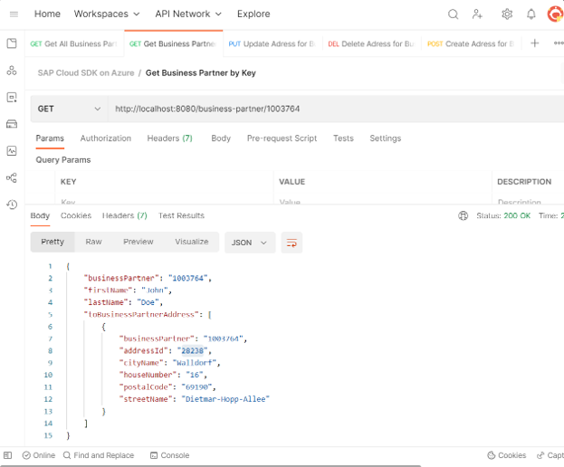
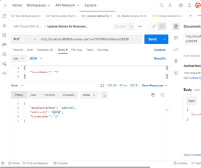
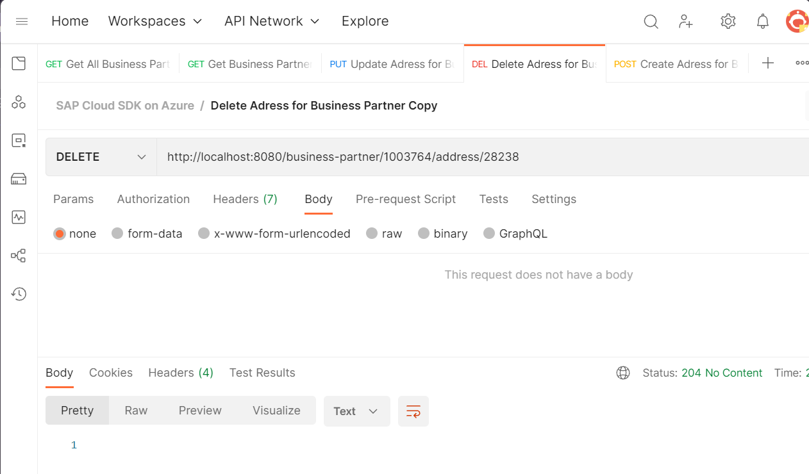
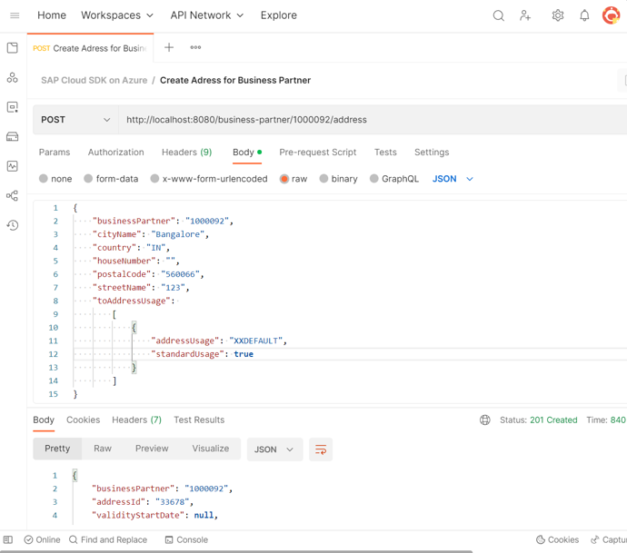

# SAP Cloud SDK on Azure App Service Quickstart 🚀

Example project showcasing [SAP Cloud SDK for JavaScript](https://sap.github.io/cloud-sdk/docs/js/tutorials/getting-started/introduction) OData consumption running on Azure App Services. It uses the [Business Partner OData API](https://api.sap.com/api/OP_API_BUSINESS_PARTNER_SRV/overview) for SAP S4 as an example.

See [SAP open-source license](https://sap.github.io/cloud-sdk/docs/overview/overview-cloud-sdk#license) for this SDK for your reference.

## Features ⚙️

Implementations using the approach described by this repos expand the [feature scope](https://sap.github.io/cloud-sdk/docs/overview/cloud-sdk-feature-matrix) of SAP's Cloud SDK for JavaScript to Azure PaaS apps.

> **Note**
> When deployed on Azure App Services instead of SAP Business Technology Platform, Cloud Foundry specific features like the destination service or xsuaa are not available.

* One code base to run on both Azure App Service and SAP Business Technology Platform
* Built in [resiliency](https://learn.microsoft.com/azure/architecture/reference-architectures/app-service-web-app/multi-region) and [caching patterns](https://learn.microsoft.com/azure/architecture/reference-architectures/app-service-web-app/scalable-web-app)
* Native [Azure authentication and token handling](https://learn.microsoft.com/azure/app-service/configure-authentication-provider-aad) with Azure AD without any coding effort
* Native [Azure virtual network integration](https://learn.microsoft.com/azure/app-service/configure-vnet-integration-enable) next to the SAP workload
* Enabled for [SAP Private Link](https://help.sap.com/docs/PRIVATE_LINK/42acd88cb4134ba2a7d3e0e62c9fe6cf/e9cc67716a3a41c9885862661e6c4234.html) and [Azure Private Link / Private Endpoint](https://learn.microsoft.com/azure/app-service/networking/private-endpoint?source=recommendations) (depending on wether you use the SAP Business Technology Platform or Azure only)
* OData v2 and v4 + entity and client generator managed by SAP
* OpenAPI + client generator managed by SAP

## Getting Started 🛫

### Prerequisites & Installation

Follow the [SAP Cloud SDK documentation for JavaScript](https://sap.github.io/cloud-sdk/docs/js/tutorials/getting-started/introduction) for your project setup.

Use either

* SAP's [mock server](https://sap.github.io/cloud-s4-sdk-book/pages/mock-odata.html),
* SAP's [public demo system ES5](https://developers.sap.com/tutorials/gateway-demo-signup.html),
* [SAP Cloud Appliance Library](https://cal.sap.com/) or
* your own available SAP system.

> **Note**
> Be aware that SAP's mock server is anticipating the S4 Cloud version of the Business Partner API. So, you might need to adapt the mock server to your needs. During our testing at the time of release there were no discrepancies discovered.

 to hit the ground running with our tailored image and avoid installing anything on your local machine and continue with step 6.

### Quickstart 🚀

0. Familiarize yourself with the [SAP Cloud SDK for JavaScript developer tutorial](https://sap.github.io/cloud-sdk/docs/js/tutorials/getting-started/introduction)
1. git clone [repository clone url](https://github.com/Azure-Samples/app-service-javascript-sap-cloud-sdk-quickstart.git)
2. cd app-service-javascript-sap-cloud-sdk-quickstart
3. `npm install`
4. `npm run start:dev`
5. browse to [http://localhost:8080](http://localhost:8080) for your "hello world"
6. maintain your SAP OData url with credentials in [.env](templates/.env) file (put in project root) and restart the app if necessary
7. browse to [http://localhost:8080/business-partner](http://localhost:8080/business-partner) for your first OData call and pick one of the business partners (examples below use ids from SAP mock server)

> **Note**
> SAP's examples for the business partner API for S4 Cloud mentioned in the tutorial **differ** to the S4 on-premises flavor. Add AddressUsage, otherwise you will see "Internal error when calling operation module BUA_CHECK_ADDRESS_VALIDITY_ALL; a check table is missing". Check SAP KBA's for more details.

8. get that business partner by id: [http://localhost:8080/business-partner/1003764](http://localhost:8080/business-partner/1003764)

9. update the address with a house number: [http://localhost:8080/business-partner/1003764/address/28238](http://localhost:8080/business-partner/1003764/address/28238)

10. delete the address: [http://localhost:8080/business-partner/1003764/address/28238](http://localhost:8080/business-partner/1003764/address/28238)

11. add an address to your chosen business partner: [http://localhost:8080/business-partner/1003764/address](http://localhost:8080/business-partner/1003764/address)

Congratulations🥳, you have successfully consumed SAP OData with the SAP Cloud SDK for JavaScript running on Azure App Service!

## Deploy to Azure 🪂

There are multiple ways to deploy this project to Azure. In this example we use the [Azure App Service extension](https://marketplace.visualstudio.com/items?itemName=ms-azuretools.vscode-azureappservice) for VS Code to deploy the project. Learn more about [this process on Microsoft learn](https://learn.microsoft.com/training/modules/create-publish-webapp-app-service-vs-code/5-exercise-publish-app-azure-app-service-vs-code?pivots=nodeexpress)

1. Create an Azure App Service with Node.js 18 LTS and Linux using the [VS Code extension for Azure](https://code.visualstudio.com/docs/azure/extensions) or use below button
2. Maintain environment variables in the [Azure App Service configuration](https://learn.microsoft.com/azure/app-service/configure-common?tabs=portal#configure-app-settings) - just like you did for the `.env` file for local execution in the previous section
3. Deploy to Web App from VS Code or GitHub Codespaces (right click in the explorer on the project folder and select "Deploy to Web App...")
4. Browse your new app powered by the SAP Cloud SDK (it takes a while the first time)

## Authentication with Azure AD 🔐

[Configure](https://learn.microsoft.com/azure/app-service/configure-authentication-provider-aad) your App Service or Azure Functions app to use Azure AD login. Use standard variable `X-MS-TOKEN-AAD-ACCESS-TOKEN` to retrieve the access token from the request header. [Learn more](https://learn.microsoft.com/azure/app-service/configure-authentication-oauth-tokens#retrieve-tokens-in-app-code)

Consider SAP Principal Propagation for your authentication scenario. [Learn more](https://learn.microsoft.com/azure/api-management/sap-api#production-considerations)

## Connectivity to SAP backends and secure virtual network access 🔌

SAP backends on Azure typically run in fully isolated virtual networks. There are multiple ways to connect to them. Most popular ones are:

* Integrate your App Service with an Azure virtual network (VNet). [Learn more](https://learn.microsoft.com/azure/app-service/configure-vnet-integration-enable).
* Private Endpoints for Azure App Service. [Learn more](https://learn.microsoft.com/azure/app-service/networking/private-endpoint?source=recommendations)
* User Azure API Management for OData with SAP Principal Propagation. [Learn more](https://learn.microsoft.com/azure/api-management/sap-api#production-considerations)

VNet integration enables your app to securely access resources in your VNet, such as your SAP Gateway, but doesn't block public access to your App Service. To achieve full private connectivity for the app service too, look into private endpoints.

## DevOps 👩🏾‍💻

* Consider activating GitHub Actions for your Azure project for out-of-the-box integrated CI/CD flows. [Learn more](https://docs.microsoft.com/azure/app-service/deploy-github-actions?tabs=applevel)
* Explore cloud-native zero-downtime deployment styles like "[blue-green](https://learn.microsoft.com/azure/architecture/example-scenario/blue-green-spring/blue-green-spring)" with Azure App Service deployment slots. [Learn more](https://docs.microsoft.com/azure/app-service/deploy-staging-slots)

## Troubleshooting 🩺

* [Access SAP Gateway logs in /IWFND/ERROR_LOG](https://wiki.scn.sap.com/wiki/display/ABAPConn/SAP+Gateway+Error+Log)
* [Azure App Service diagnostics](https://docs.microsoft.com/azure/app-service/troubleshoot-diagnostic-logs)
* Use [Kudu SSH console](https://learn.microsoft.com/azure/app-service/resources-kudu) from VNet integrated App Service to check connectivity to SAP Gateway with `curl https://<your domain>:<your https port>/sap/opu/odata/sap/API_BUSINESS_PARTNER -u "<user>:<password>"`
* [Azure API Management Request tracing](https://learn.microsoft.com/azure/api-management/api-management-howto-api-inspector)
* [Azure API Management Gateway logs](https://learn.microsoft.com/azure/api-management/api-management-howto-use-azure-monitor#view-diagnostic-data-in-azure-monitor)

## Resources

* [SAP Cloud SDK documentation for JavaScript](https://sap.github.io/cloud-sdk/docs/js/tutorials/getting-started/introduction)

* [SAP Cloud SDK repos for JavaScript](https://github.com/SAP/cloud-sdk-js)

* [SAP Cloud SDK for JavaScript API documentation](https://sap.github.io/cloud-sdk/api/2.10.0/)

* [.NET speaks OData too – how to implement Azure App Service with SAP Gateway](https://github.com/MartinPankraz/AzureSAPODataReader)

* [Azure API Management policy for SAP Principal Propagation](https://github.com/Azure/api-management-policy-snippets/blob/master/examples/Request%20OAuth2%20access%20token%20from%20SAP%20using%20AAD%20JWT%20token.xml)

## Contributing 👩🏼‍🤝‍👨🏽

This project welcomes contributions and suggestions. Please use [GitHub Issues](https://github.com/Azure-Samples/app-service-javascript-sap-cloud-sdk-quickstart/issues) to report errors or request new features. For conceptual conversations, please use [GitHub Discussions](https://github.com/Azure-Samples/app-service-javascript-sap-cloud-sdk-quickstart/discussions/categories/ideas)

This project has adopted the [Microsoft Open Source Code of Conduct](https://opensource.microsoft.com/codeofconduct/).
For more information see the [Code of Conduct FAQ](https://opensource.microsoft.com/codeofconduct/faq/) or
contact [opencode@microsoft.com](mailto:opencode@microsoft.com) with any additional questions or comments.

## Trademarks™

This project may contain trademarks or logos for projects, products, or services. Authorized use of Microsoft trademarks or logos is subject to and must follow [Microsoft's Trademark & Brand Guidelines](https://www.microsoft.com/legal/intellectualproperty/trademarks/usage/general).
Use of Microsoft trademarks or logos in modified versions of this project must not cause confusion or imply Microsoft sponsorship.
Any use of third-party trademarks or logos are subject to those third-party's policies.
