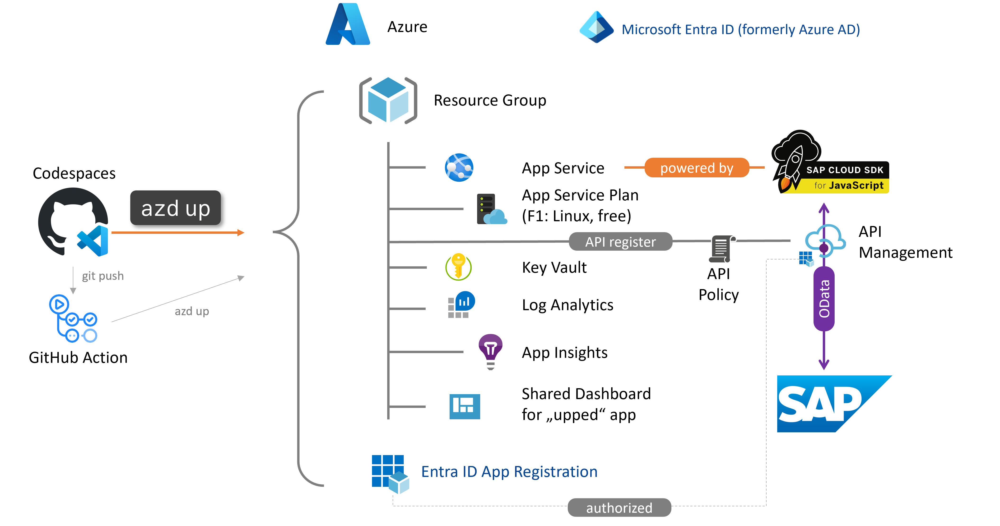

# SAP Cloud SDK on Azure App Service Quickstart 🚀

[](https://github.com/codespaces/new?hide_repo_select=true&ref=main&repo=576207479)[](https://portal.azure.com/#create/Microsoft.Template/uri/https%3A%2F%2Fraw.githubusercontent.com%2FAzure-Samples%2Fapp-service-javascript-sap-cloud-sdk-quickstart%2Fmain%2Ftemplates%2Fazuredeploy.json)

This repos serves as quick-start project showcasing [SAP Cloud SDK for JavaScript](https://sap.github.io/cloud-sdk/docs/js/tutorials/getting-started/introduction) OData consumption running on [Azure App Services](https://learn.microsoft.com/azure/app-service/overview). Its primary purpose is to set you up for success for your SAP extension project on Azure and reduce the lead time to your first successful deployment as much as possible with developer friendly commands.

It uses the [Business Partner OData v2 API](https://api.sap.com/api/OP_API_BUSINESS_PARTNER_SRV/overview) for SAP S/4HANA as an example.

The project is setup as per the best practices advocated by the [Azure Developer CLI](https://learn.microsoft.com/azure/developer/azure-developer-cli/overview) and referenced as [official awesome azd template](https://azure.github.io/awesome-azd/?tags=sapcloudsdk).

Looking for [**Azure Functions**](https://learn.microsoft.com/azure/azure-functions/functions-overview?pivots=programming-language-javascript) instead? [Here](https://github.com/Azure-Samples/functions-javascript-sap-cloud-sdk-quickstart) you go.



> **Warning** - Verify latest [SAP's open-source license](https://sap.github.io/cloud-sdk/docs/overview/overview-cloud-sdk#license) for the Cloud SDK for your reference.

> **Note** - In case you need to translate between OData versions and metadata specification use our converter [here](https://aka.ms/ODataOpenAPI).

> **Note** - In case you prefer an implementation without 3rd party library dependencies, have a look at [this sister project](https://github.com/Azure/azure-sdk-for-sap-odata) deploying to Azure Functions.

> **Note** - Looking for SAP Cloud SDK for Java? See [this annoucement](https://blogs.sap.com/2023/11/02/sap-btp-innovations-for-an-optimized-development-experience-teched-2023/) by SAP on the open-sourcing schedule in Q4/2023.

## Features ⚙️

Implementations using the approach described by this repos expand the [feature scope](https://sap.github.io/cloud-sdk/docs/overview/cloud-sdk-feature-matrix) of SAP's Cloud SDK for JavaScript to Azure PaaS apps.

> **Note** - When deployed on Azure App Services instead of SAP Business Technology Platform, Cloud Foundry specific features like the destination service or XSUAA are not available.

* One code base to run on both Azure App Service and SAP Business Technology Platform
* Built in [resiliency](https://learn.microsoft.com/azure/architecture/reference-architectures/app-service-web-app/multi-region) and caching patterns
* Native [Azure authentication and token handling](https://learn.microsoft.com/azure/app-service/configure-authentication-provider-aad) with Azure AD without any coding effort. Simply switch on the Microsoft Entra ID for your App Service on the AZD config [here](infra/main.bicep) using variable `useEntraIDAuthentication`.
* Configurable Azure API Management integration for SAP APIs including policy enforcement for use cases like request throttling, SAP token caching, etc.
* Native [Azure virtual network integration](https://learn.microsoft.com/azure/app-service/configure-vnet-integration-enable) next to the SAP workload
* Enabled for [SAP Private Link](https://help.sap.com/docs/PRIVATE_LINK/42acd88cb4134ba2a7d3e0e62c9fe6cf/e9cc67716a3a41c9885862661e6c4234.html) and [Azure Private Link / Private Endpoint](https://learn.microsoft.com/azure/app-service/networking/private-endpoint?source=recommendations) (depending on wether you use the SAP Business Technology Platform or Azure only)
* OData v2 and v4 + entity and client generator managed by SAP
* OpenAPI + client generator managed by SAP

Example uses [pug engine](https://pugjs.org/api/getting-started.html) for rendering the UI. Learn more about template engines [here](https://docs.nestjs.com/techniques/mvc).

## Getting Started 🛫

### Prerequisites & Installation

Follow the [SAP Cloud SDK documentation for JavaScript](https://sap.github.io/cloud-sdk/docs/js/tutorials/getting-started/introduction) for your project setup.

Use any OData enabled SAP system:

* SAP's [mock server](https://github.com/SAP-archive/cloud-s4-sdk-book/tree/mock-server) (used in screenshots below),
* SAP API Business Hub [S/4HANA Cloud sandbox with APIKey](https://api.sap.com/api/API_BUSINESS_PARTNER/tryout) (⚠️read-only)
* SAP's [public demo system ES5](https://developers.sap.com/tutorials/gateway-demo-signup.html) (⚠️Business Partner API not activated!),
* S/4HANA Fully-Activated Appliance from [SAP Cloud Appliance Library](https://cal.sap.com/) or
* your own available in-house SAP system.

> **Note** - Be aware that SAP's mock server is anticipating the S4 Cloud version of the Business Partner API. So, you might need to adapt the mock server to your needs. During our testing at the time of release there were no discrepancies discovered. You may expose the mock server running locally for testing with the cloud services to the internet using [ngrok](https://ngrok.com/) or similar tools.

[](https://github.com/codespaces/new?hide_repo_select=true&ref=main&repo=576207479) to hit the ground running with our tailored image and avoid installing anything on your local machine and continue with step 6.

### Quickstart 🚀

0. familiarize yourself with the [SAP Cloud SDK for JavaScript developer tutorial](https://sap.github.io/cloud-sdk/docs/js/tutorials/getting-started/introduction)
1. Run the following command to initialize the project.

   ```bash
   azd init --template app-service-javascript-sap-cloud-sdk-quickstart
   ```

   This command will clone the code to your current folder and prompt you for `Environment Name`. This will be used as a prefix for the resource group that will be created to hold all Azure resources. This name should be unique within your Azure subscription.

2. Run the following command to package a deployable copy of your application, provision the template's infrastructure to Azure and also deploy the application code to those newly provisioned resources.

   ```bash
   azd up
   ```

This command will prompt you for the following information:

- `Azure Location`: The Azure location where your resources will be deployed.
- `Azure Subscription`: The Azure Subscription where your resources will be deployed.

   > **Note** - This may take a while to complete as it executes three commands: `azd package` (packages a deployable copy of your application), `azd provision` (provisions Azure resources), and `azd deploy` (deploys application code). You will see a progress indicator as it packages, provisions and deploys your application.

3. Select suitable [VS Code workspace](https://code.visualstudio.com/docs/editor/workspaces). We suggest [bicep](workspaces/azd-bicep.code-workspace) as it is the default for Azure Developer CLI.
4. `cd app-service-javascript-sap-cloud-sdk-quickstart/src/api`
5. `npm install`
6. `npm run start:dev`
7. browse to [http://localhost:8080](http://localhost:8080) for your "hello world"
8. maintain your SAP OData url with credentials in [.env](templates/.env) file (put in project root `app-service-javascript-sap-cloud-sdk-quickstart/src/api`) and restart the app if necessary
9. browse to [http://localhost:8080/business-partner](http://localhost:8080/business-partner) for your first OData call and pick one of the business partners (examples below use ids from SAP mock server)

   > **Note** - SAP's examples for the business partner API for SAP S/4HANA Cloud mentioned in the tutorial **differ** to the SAP S/4HANA on-premises flavor. Add AddressUsage, otherwise you will see "Internal error when calling operation module BUA_CHECK_ADDRESS_VALIDITY_ALL; a check table is missing". Check SAP KBA's for more details.

10. get that business partner by id: [http://localhost:8080/business-partner/1003764](http://localhost:8080/business-partner/1003764)

   

11. update the address with a house number: [http://localhost:8080/business-partner/1003764/address/28238](http://localhost:8080/business-partner/1003764/address/28238).

   > **Note** - For your convenience we provide a [collection of REST calls](/templates/business-partner-requests.http) in the repos. Execute them with the [VS Code REST client](https://marketplace.visualstudio.com/items?itemName=humao.rest-client).

  

12. delete the address: [http://localhost:8080/business-partner/1003764/address/28238](http://localhost:8080/business-partner/1003764/address/28238)

   

13. add an address to your chosen business partner: [http://localhost:8080/business-partner/1003764/address](http://localhost:8080/business-partner/1003764/address)

   

**Congratulations** 🥳, you have successfully consumed SAP OData with the SAP Cloud SDK for JavaScript running on Azure App Service!

## Deploy to Azure 🪂

There are multiple ways to deploy this project to Azure. We provide two options in this repository:

1. via template deployment and VS Code extension. This approach allows an quick deployment to Azure but does not necessarily reflect the best practices. You find more information on this option [here](documentation/DEPLOYMENT-VSCODE.md).
2. via [Azure Developer CLI](https://learn.microsoft.com/azure/developer/azure-developer-cli/overview) using `azd up`. This approach enables a quick and easy deployment and already contains best practices. It serves as a perfect starting point for a production grade setup. You find more information on this option [here](documentation/DEPLOYMENT-AZD.md).

> **Note** - If you choose to deploy to Azure via `azd` we provide two options to define the Infrastructure as Code, namely `Bicep` and `Terraform`. To make your life easier we provide two distinct [workspaces](https://code.visualstudio.com/docs/editor/workspaces#_multiroot-workspaces) for that to show you the relevant files and folders. If you want to go for `Bicep` you can open the workspace `workspaces/azd-bicep.code-workspace`, for Terraform go for the workspace `workspaces/azd-terraform.code-workspace`.

## Deploy to SAP BTP 🪂

We provide the necessary configurations for the deployment to SAP BTP leveraging the open source project [btp setup automator](https://github.com/SAP-samples/btp-setup-automator). The configuration comprises the infrastructure as well as the mta build and the deployment to Cloud Foundry. You find more information [here](./documentation/DEPLOYMENT-BTPSA.md).

## What's next?

You can do a lot more once the app is deployed. Curious? We go you covered with some more information on topics like Entra ID authentication [here](documentation/WHATS-NEXT.md).

## Troubleshooting 🩺

Sometimes things do not work as expected. Here are some resources that support you in finding and fixing the issue:

* [Access SAP Gateway logs in /IWFND/ERROR_LOG](https://wiki.scn.sap.com/wiki/display/ABAPConn/SAP+Gateway+Error+Log)
* [Azure App Service diagnostics](https://docs.microsoft.com/azure/app-service/troubleshoot-diagnostic-logs)
* Use [Kudu SSH console](https://learn.microsoft.com/azure/app-service/resources-kudu) from VNet integrated App Service to check connectivity to SAP Gateway with `curl https://<your domain>:<your https port>/sap/opu/odata/sap/API_BUSINESS_PARTNER -u "<user>:<password>"`
* [Azure API Management Request tracing](https://learn.microsoft.com/azure/api-management/api-management-howto-api-inspector)
* [Azure API Management Gateway logs](https://learn.microsoft.com/azure/api-management/api-management-howto-use-azure-monitor#view-diagnostic-data-in-azure-monitor)

## Additional resources

We collected additional resources and related efforts and projects [here](documentation/ADDITIONAL-RESOURCES.md).

## Contributing 👩🏼‍🤝‍👨🏽

This project welcomes contributions and suggestions. Please use [GitHub Issues](https://github.com/Azure-Samples/app-service-javascript-sap-cloud-sdk-quickstart/issues) to report errors or request new features. For conceptual conversations, please use [GitHub Discussions](https://github.com/Azure-Samples/app-service-javascript-sap-cloud-sdk-quickstart/discussions/categories/ideas)

This project has adopted the [Microsoft Open Source Code of Conduct](https://opensource.microsoft.com/codeofconduct/).
For more information see the [Code of Conduct FAQ](https://opensource.microsoft.com/codeofconduct/faq/) or
contact [opencode@microsoft.com](mailto:opencode@microsoft.com) with any additional questions or comments.

## Trademarks™

This project may contain trademarks or logos for projects, products, or services. Authorized use of Microsoft trademarks or logos is subject to and must follow [Microsoft's Trademark & Brand Guidelines](https://www.microsoft.com/legal/intellectualproperty/trademarks/usage/general).
Use of Microsoft trademarks or logos in modified versions of this project must not cause confusion or imply Microsoft sponsorship.
Any use of third-party trademarks or logos are subject to those third-party's policies.
