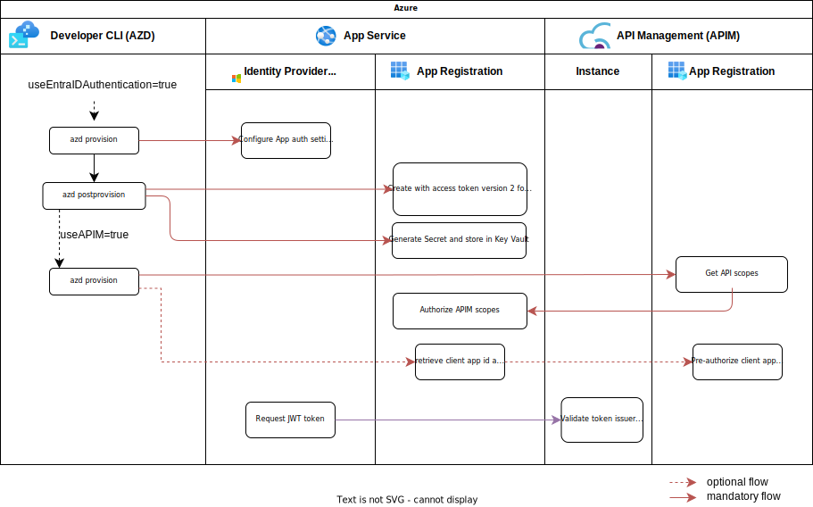

# Authentication with Microsoft Entra ID (formerly Azure AD) 🔐

## Portal experience

[Configure](https://learn.microsoft.com/azure/app-service/configure-authentication-provider-aad) your App Service or Azure Functions app to use Entra ID login. Use standard variable `X-MS-TOKEN-AAD-ACCESS-TOKEN` to retrieve the access token from the request header.

## Azure Developer CLI experience

Simply switch on the Microsoft Entra ID option for your App Service on the AZD config [here](../infra/main.bicep) using variable `useEntraIDAuthentication`.

> **Note** - Mind the differences of your webapp auth config-version. You may check via
> `az webapp auth config-version show --name <app-name> --resource-group <rg name>`
> The default is v1. Above mentioned switch activates v2 during bicep deployment. Latest Entra ID authentication requires v2. Note that the Azure portal authentication provider add-experience also creates v2 configuration. [Learn more about upgrading from v1 to v2](https://learn.microsoft.com/cli/azure/webapp/auth/config-version?view=azure-cli-latest#az-webapp-auth-config-version-upgrade)
>
> [Learn more about retrieving tokens](https://learn.microsoft.com/azure/app-service/configure-authentication-oauth-tokens#retrieve-tokens-in-app-code)

## SAP Principal Propagation

Consider SAP Principal Propagation for your authentication scenario handled by [Azure API Management](https://learn.microsoft.com/azure/api-management/sap-api#production-considerations). Activate `useAPIM` flag to inject OData API into Azure API Management and pre-authorize its exposed scopes to the Azure web app.

[Learn more](https://github.com/Azure/api-management-policy-snippets/blob/master/examples/Request%20OAuth2%20access%20token%20from%20SAP%20using%20AAD%20JWT%20token.xml)

